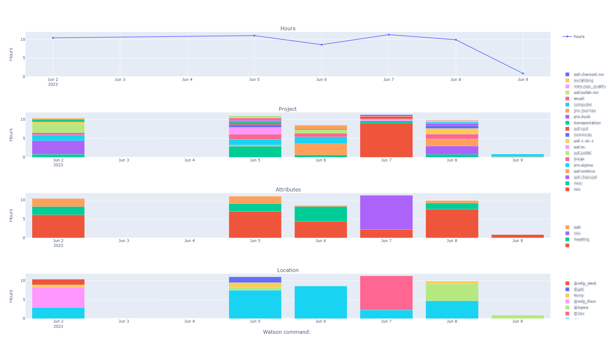
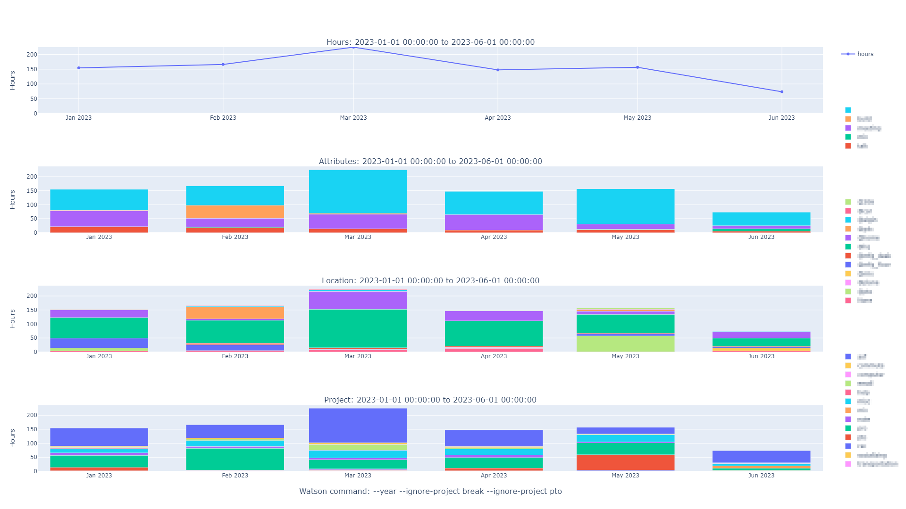
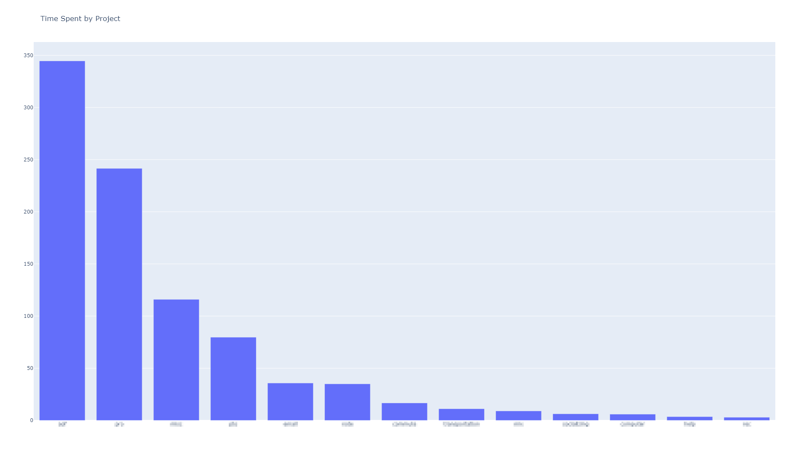

# watson-graphing

watson-graphing is a command-line program that generates graphs from [Watson](https://tailordev.github.io/Watson/), a command-line manual time-tracking tool.

## Example Usage

To plot data from the past week using defaults, just run the program with no options:
```
$ watson-graphing
```


To plot Watson data from current year except the projects `break` and `pto` for specified plots (hours, attributes, and location), by month, sorting alphabetically, and truncating project names before the first period, run:
```
$ watson-graphing --plot hours attributes location --period month --sort name --truncate --date year ignore-project break ignore-project pto
```



## Getting Started

### Installation

This project is not published on PyPI (pip) yet. If you would like it to be, please open an issue.

To install, clone/download the repository and then install.
```
$ git clone https://github.com/k4j8/watson-graphing.git
$ pip install [--editable] watson-graphing
```

### Usage

Watson must also be installed and have at least one frame to show for watson-graphing to work. Commands take the form `watson-graphing [options] WATSON_ARGS...`.

- `options` are available via `watson-graphing --help`
- `WATSON_ARGS` are inputs to the cammand `watson log...` WITHOUT hyphens. (Weird, I know, but it works.)

For example, to plot the result of `watson log --project voyager2 --project apollo11`, run `watson-graphing project voyager2 project apollo11`.

Keep in mind `watson log` defaults to the past 7 days, so to get more data you need to include `year`, `all`, or any other option available via `watson log`.

watson-graphing splits Watson's tags into two categories: attributes and location. Locations are tags beginning with "@" such as "@office" or "@home". Attributes are all other tags.

### Contributing

This is a personal project but I'm willing to make it more universal if there's an interest. Please use the issue tracker if you have suggestions, feedback, or want to contribute.
